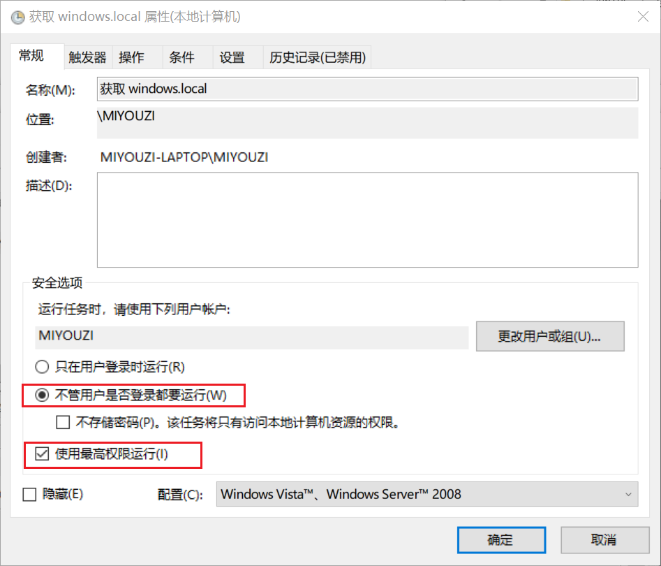
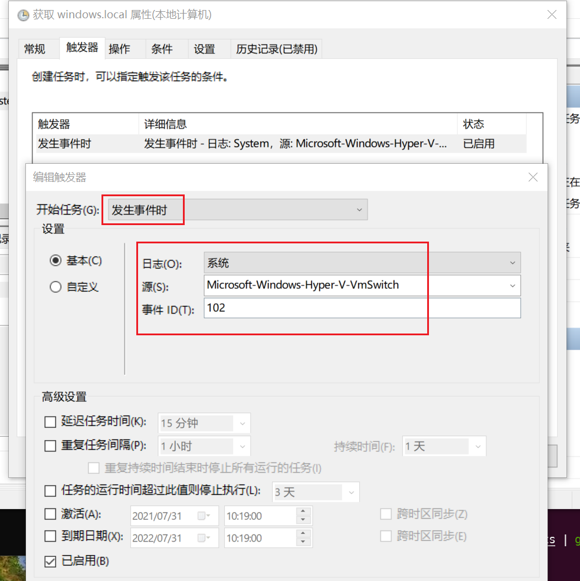

# findWindowsWSL_IP
## 简介

自动查找 Windows 在WSL网络中的IP，并写入 hosts。

自动刷新默认发行版系统的 Hosts，配合任务计划，当 WSL 启动时才执行脚本。刷新 WSL hosts 不会中断当前终端会话。

Windows 域名 `windows.local`

## 必要配置

将默认发行版系统的默认用户的密码写到 `wsl_passwd.ini` 文件中，纯密码，仅一行，用于不中断会话刷新 WSL hosts。

## 任务计划配置

### 常规配置

- 勾选 `不管用户是否登录都要运行` （可后台运行）
- 勾选 `使用最高权限运行` （编辑 hosts 必要，脚本也会检测是否获取管理员权限）
- 

### 触发器配置

- `开始任务` 选择 `发生事件时`
- `日志` 选择 `系统`
- `源` 填入 `Microsoft-Windows-Hyper-V-VmSwitch`
- `事件` 填入 `102`
- 

